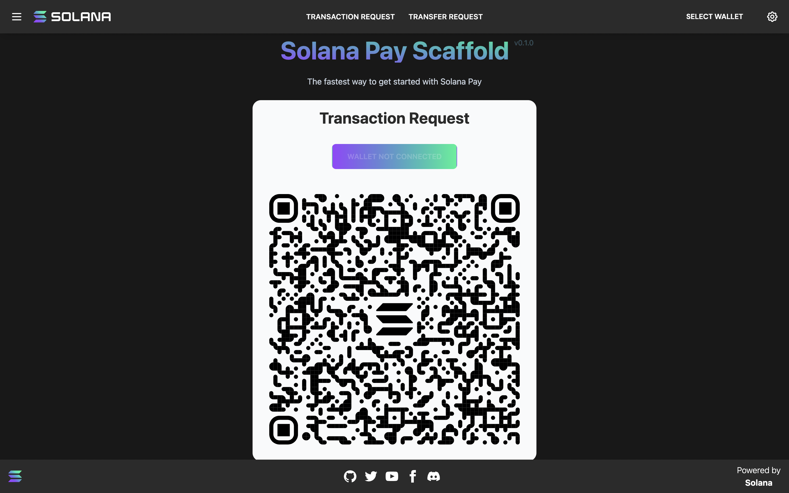
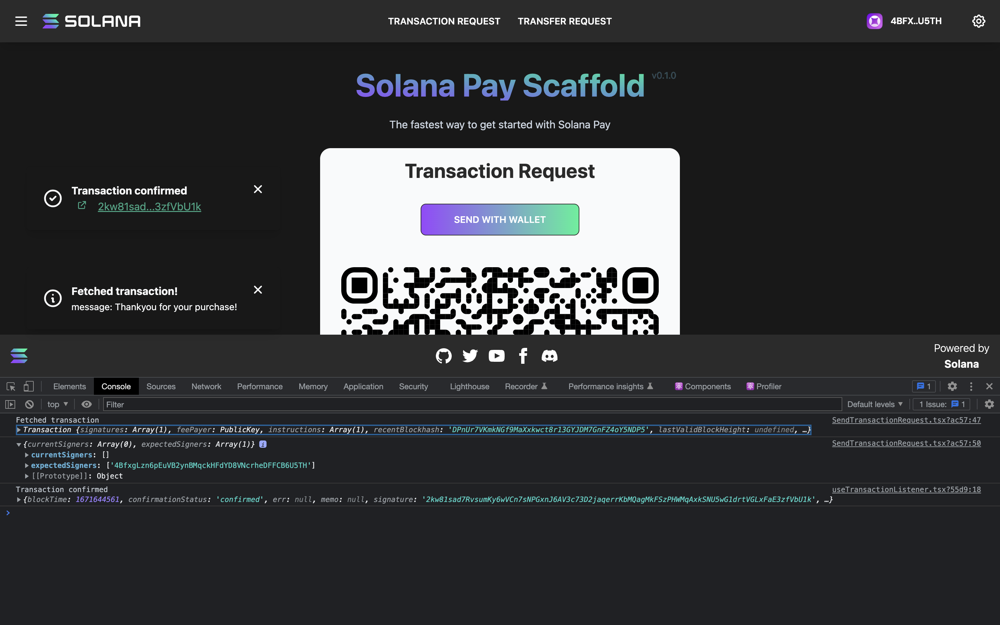

# Solana Pay Scaffold

This repo is intended to help you get up and running quickly when building an application using Solana Pay. It supports both transaction and transfer requests, and both Solana Pay QR codes and using a connected wallet in the browser are available.



To test transaction requests, simply change the transaction returned by [the /api/transaction route](./src/pages/api/transaction.ts). To debug, use a connected wallet and the returned transaction and expected signers will be displayed in the console:



## Getting Started

This is a [Next.js](https://nextjs.org/) project bootstrapped with [`create-next-app`](https://github.com/vercel/next.js/tree/canary/packages/create-next-app).

## Installation

```bash
npm install
# or
yarn install
```

## Build and Run

Next, run the development server:

```bash
npm run dev
# or
yarn dev
```

Open [http://localhost:3000](http://localhost:3000) with your browser to see the result.

You can start editing the transaction request page by modifying `src/pages/index.tsx`. The page auto-updates as you edit the file.

[API routes](https://nextjs.org/docs/api-routes/introduction) can be accessed on [http://localhost:3000/api/transaction](http://localhost:3000/api/transaction). This endpoint can be edited in `src/pages/api/transaction.ts`.

## Scanning QR codes

Solana Pay only works with https URLs, so you won't be able to scan QR codes from a `http://localhost` or `http://192.168...` domain with a wallet.

The easiest way in dev is to use [ngrok](https://ngrok.com). Once you install it you'll be able to run `ngrok http 3000` to get your app running on an https ngrok subdomain. Visiting that subdomain will be identical to your localhost, including hot reloading. But because it's public and https, you'll be able to scan Solana Pay QR codes with any compatible wallet.

## Reference

The `reference` in Solana Pay refers to a unique public key that is included as an account in a transaction, so that we can listen for a transaction including it. It doesn't affect the behavior of the transaction, and is neither a signer nor writeable.

When we create a transaction request QR code we don't know what transaction is going to be created. The API can return any transaction, and can for example choose to return different transactions based on the user requesting the transaction.

We can use the `findReference` function to find a transaction on-chain with the given reference. This allows us to display the QR code on one device, scan it and sign/send the transaction in a wallet on a different device/network, and detect it on the device displaying the QR code (or anywhere else) immediately, without knowing anything about the transaction beforehand - except that it will include the `reference`. An example hook that listens for transactions with a given reference is at [useTransactionListener.tsx](./src/hooks/useTransactionListener.tsx).

## Contributing

Anyone is welcome to create an issue to build, discuss or request a new feature or update to the existing code base. Please keep in mind the following when submitting an issue. We consider merging high value features that may be utilized by the majority of scaffold users. If this is not a common feature or fix, consider adding it to the cookbook. Please refer to the project's architecture and style when contributing.

If submitting a feature, please try to follow the overall architecture and style presented in the existing scaffold.

### Committing

To choose a task or make your own, do the following:

1. [Add an issue](https://github.com/solana-labs/solana-pay-scaffold/issues/new) for the task and assign it to yourself or comment on the issue
2. Make a draft PR referencing the issue.

The general flow for making a contribution:

1. Fork the repo on GitHub
2. Clone the project to your own machine
3. Commit changes to your own branch
4. Push your work back up to your fork
5. Submit a Pull request so that we can review your changes

**NOTE**: Be sure to merge the latest from "upstream" before making a
pull request!

## Learn More Next Js

To learn more about Next.js, take a look at the following resources:

- [Next.js Documentation](https://nextjs.org/docs) - learn about Next.js features and API.
- [Learn Next.js](https://nextjs.org/learn) - an interactive Next.js tutorial.

You can check out [the Next.js GitHub repository](https://github.com/vercel/next.js/) - your feedback and contributions are welcome!

## Deploy on Vercel

The easiest way to deploy your Next.js app is to use the [Vercel Platform](https://vercel.com/new?utm_medium=default-template&filter=next.js&utm_source=create-next-app&utm_campaign=create-next-app-readme) from the creators of Next.js.

Check out our [Next.js deployment documentation](https://nextjs.org/docs/deployment) for more details.
